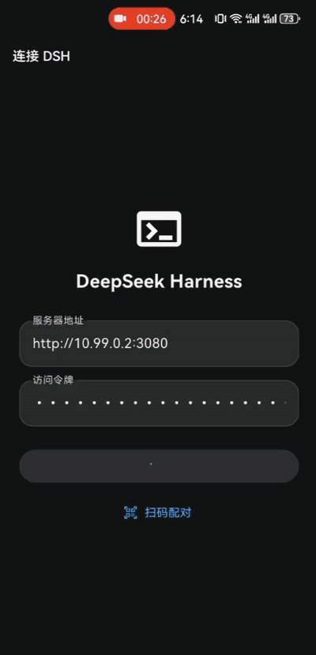
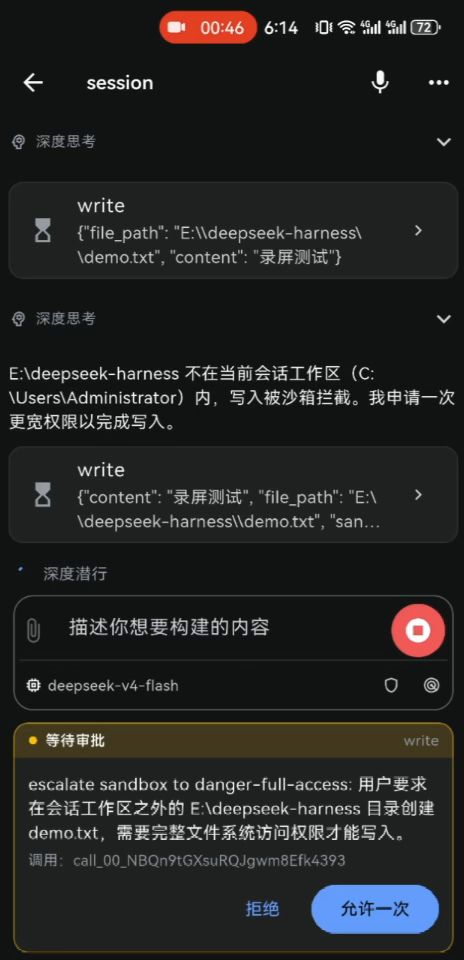
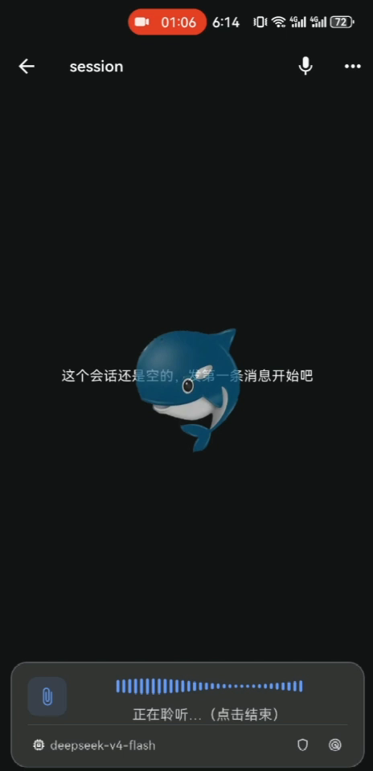
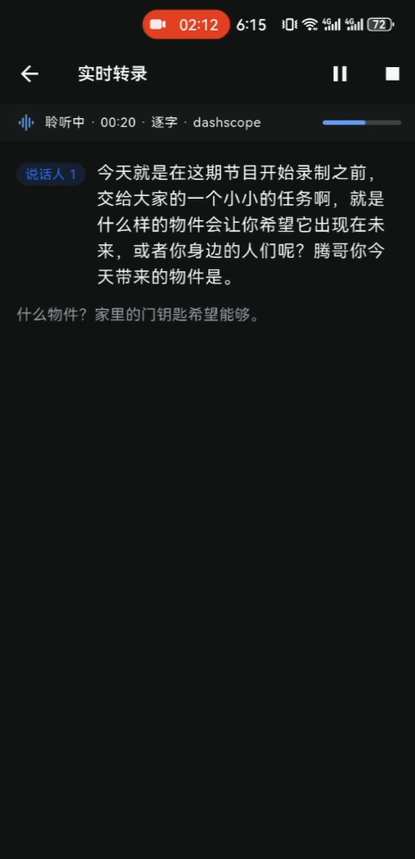

# agent-mobile

面向 AI Agent 工具的移动端配套仓库：**当前适配 DeepSeek Harness（[dsh](https://github.com/deepseek-ai/deepseek-harness)）**，OpenClaw / ZCode 等陆续接入。包含两部分：

| 目录 | 内容 | 版本 |
| --- | --- | --- |
| [`dsh_mobile_app/`](dsh_mobile_app/) | Flutter 手机 App：在手机上使用 dsh agent（聊天、审批、语音） | 1.0.99 |
| [`dsh_dart_sdk/`](dsh_dart_sdk/) | 纯 Dart SDK：手写镜像宿主 `/api` 线协议（`dsh-client-connection` / `dsh-host-apiproxy` 的 Dart 对应物） | 0.1.0 |

App 不依赖任何 fork：配合官方 dsh + 两个服务端插件即可使用——

- [dsh-mobile-gateway](https://github.com/agent-mobile/dsh-mobile-gateway)：局域网访问 + token 门控 `/m/api`（**必需**）
- [dsh-speech](https://github.com/agent-mobile/dsh-speech)：ASR / TTS / 实时转录（语音功能需要）



| 工具调用审批 | 语音对话（ASR + TTS） | 实时转写 |
| --- | --- | --- |
|  |  |  |
| 工作区外写入先弹审批卡，点「允许一次」继续，拒绝即不动 | 对它说话实时转写，AI 流式回复并语音播报 | 长段落逐句出稿、带说话人标签，一键发送到对话 |

## 快速上手

**1. 服务端**（电脑）：安装 dsh 与插件，配一个 token：

```sh
npm install -g @deepseek-ai/dsh
dsh plugin --profile web add github:agent-mobile/dsh-mobile-gateway
dsh plugin --profile web add github:agent-mobile/dsh-speech   # 语音功能需要

# 在 ~/.dsh/profiles/web/cordis.patch.yml 中为两个插件各配同一个 token：
#   - id: mobile-gateway
#     config: { token: 换成一个长随机串 }
#   - id: speech
#     config: { token: 同上 }

dsh web
# 启动行会打印局域网地址，例如:
# dsh web: http://127.0.0.1:3080 (LAN: http://192.168.1.5:3080)
```

> 首次启动 Windows 会弹防火墙授权，勾选专用网络放行。

**2. 手机端**：与电脑连同一 Wi-Fi。

- **直接安装**：从 [Releases](../../releases) 下载最新 APK 安装（系统会要求允许安装未知来源应用）
- 打开 App，填服务器 `http://<电脑IP>:3080` 与 token（或在电脑浏览器打开 `http://127.0.0.1:3080/m/` 生成 token 与配对二维码，App 扫码自动填入）

## 从源码构建

- Flutter 3.41+ / Dart ^3.11（App）；纯 Dart ^3.11（SDK）
- Android 构建：Android SDK 35 相关工具链

```sh
git clone https://github.com/agent-mobile/agent-mobile.git
cd agent-mobile

# SDK 单测
cd dsh_dart_sdk && dart pub get && dart test && cd ..

# App（会连同 path 依赖 ../dsh_dart_sdk 一起拉起）
cd dsh_mobile_app && flutter pub get && flutter test
flutter build apk --release
# 产物: build/app/outputs/flutter-apk/app-release.apk
```

> 仓库里的 `build_apk.ps1` 是维护者在本机（网络受限、使用本地 Gradle/JDK）的构建脚本，**外部贡献者不需要它**，走上面的标准 `flutter build apk` 即可。

## 文档索引

- **[语音对话 · 实时转写 · 远程组网 完整指南](docs/VOICE-AND-NETWORK.md)**：文字/语音模式切换、实时转写、dsh-speech 语音链路配置、局域网 / 蒲公英 / WireGuard 组网
- [App 功能与开发说明](dsh_mobile_app/README.md)
- [Dart SDK 用法](dsh_dart_sdk/README.md)
- [`SDK-0.1.2-MIGRATION.md`](SDK-0.1.2-MIGRATION.md)：dsh 0.1.1 → 0.1.2 的 `/api` 协议变化与 Dart 侧映射（改协议先读这份）

## 版本对齐

宿主 dsh `0.1.2-rc.1` ↔ 两个插件 `0.1.2-rc.1` devDeps ↔ SDK 手写协议 `0.1.2`。宿主升级涉及 `packages/client/connection` 或 `packages/host/apiproxy` 的变更时，需要同步更新 Dart SDK 与其测试。

## 许可证

[MIT](LICENSE)
